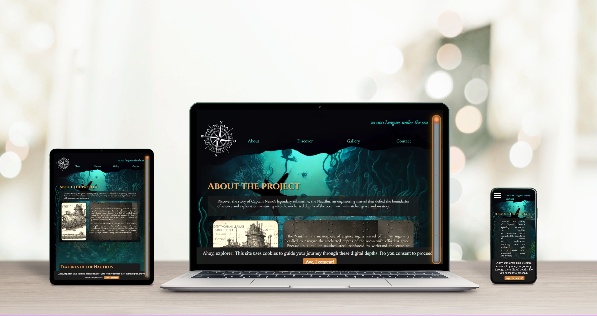

# 🦑 20 000 mil pod mořem – Steampunkový web

Tento projekt je statická webová stránka inspirovaná románem *20 000 mil pod mořem* od Julese Verna. Cílem bylo vytvořit poutavý design ve steampunk stylu s kombinací vintage prvků, ilustrací a interaktivních animací. Jedná se o školní zadání / samostatný designový projekt bez napojení na backend.

## 📸 Náhled

## ✨ Co web nabízí
- Jednostránkový design ve steampunk stylu  
- Animované prvky jako parní efekt, pohybující se pozadí nebo strojky  
- Stylizovaný text a ilustrace inspirované dobovým vzhledem  
- Vlastní typografie a retro paleta barev  
- Základní interaktivita přes JavaScript (např. otáčení zubů stroje)  
- Plně responzivní layout  

## 🧰 Použité technologie
- HTML5  
- SCSS (proměnné, zanořování, media queries)  
- JavaScript (základní interaktivita a animace)  
- Google Fonts (dobové fonty)  
- Obrázky a SVG grafika  

## 🎯 Cíl projektu
Navrhnout kreativní jednostránkový web, který vtáhne uživatele do podmořského světa kapitána Nema. Projekt klade důraz na vizuální zážitek a atmosféru.

## 🧪 Co jsem se naučila
- Jak pracovat s motivem a přetvořit ho do jednotného vizuálního stylu  
- Využití pokročilejšího SCSS pro správu stylů  
- Jak vytvořit efektní design s důrazem na atmosféru bez použití knihoven  
- Přesnější práci s pozadím, vrstvami a animací  

## 🔗 Odkazy
- 🔗 [Zdrojový kód na GitHubu](#)
- 🌐 (Živý náhled zatím není dostupný)

Projekt byl vytvořen jako součást portfolia a slouží jako ukázka grafického a stylového zpracování webu.
"""

readme_path = Path("/mnt/data/README_20000_Leagues.md")
readme_path.write_text(readme_text.strip(), encoding="utf-8")
readme_path
